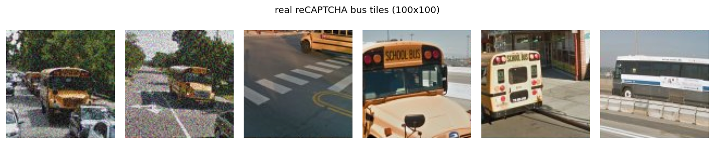
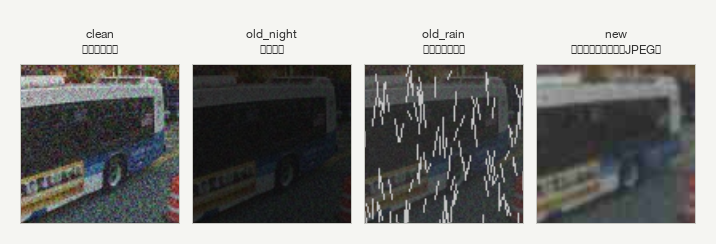

# 進捗報告（2026-07-07）画像分類班

## 2. 画像当てチャレンジ（画像分類）

reCAPTCHA の「お題に合うマスを選ぶ」課題のうち、1マスずつ bus / other を判定する側を担当。
マスの位置当て（3×3のどこか）は物体検出班の担当。

### 2-1. 使用モデル

ResNet18（ImageNet 事前学習済み）で2方式を比較する。

- **zero-shot**：追加学習なしでそのまま使用。学習なしの基準。
- **fine-tuned（FT）**：bus / other の2クラスに微調整。学習データは COCO から集めた画像に劣化フィルタで水増ししたもの。

### 2-2. 目標判別精度 ＋ フィルタ妥当性

**目標**：画像選択型 reCAPTCHA の人間の正答率は約 **81%**（文献値）とされる。これを超えることを目標とする。
出典：Searles et al., *An Empirical Study & Evaluation of Modern CAPTCHAs*, USENIX Security 2023
（https://www.usenix.org/system/files/usenixsecurity23-searles.pdf）

**使った指標**：モデルの強さは **AP（PR曲線の下の面積、閾値に依存しない）** と **F1（適合率と再現率の調和平均）** で測る。
フィルタの妥当性は **FID（本物との特徴分布の距離、小さいほど似ている）** で測る。

**達成した精度**：本物 reCAPTCHA（bus 6,693 / nonbus 6,693）での結果。

| 評価データ | zero-shot AP | fine-tuned AP | 差 |
|---|---:|---:|---:|
| 本物 reCAPTCHA | 0.875 | **0.906** | **+0.031** |

- 本物での **FT 最大F1 = 0.827（≒82.7%）** で、目標の人間 81% を上回った。
- FT−zero-shot の差 +0.031 は、ブートストラップ法（1万回リサンプル）でも 95%区間が 0 を跨がず、偶然ではないことを確認した（区間は旧フィルタモデルで測定。現行モデルでの再計測は課題）。
- 参考：劣化のない通常写真では zero-shot の方が強い（ImageNet で元々バスを見分けられるため）。FT が効くのは本物のような劣化した画像。

**フィルタの妥当性（前回の指摘への回答）**

「学習の劣化ノイズは本物に似ているか」を FID で定量化した。まず本物を見てから作り直した。

1. 実際の reCAPTCHA v2 の実画像 29,568枚（HuggingFace の recaptchav2-29k）を導入し、数枚を目視で確認した。

   

   解像度が 100×100 と小さく、細部が潰れてノイズが乗っている。旧フィルタの夜や雨の加工は的外れだったと考えた。
2. 新しくフィルタを作り直し、低解像度化＋ぼかし＋彩度低下＋JPEG 低品質再圧縮を施した。

   

   左から、オリジナル、旧・夜フィルタ、旧・雨フィルタ、新フィルタ。
3. 本当に新フィルタが本物に近いのか FID で測った（同じクリーン画像にフィルタだけ変えてかけ、本物 bus と比較）。

| フィルタ | FID | 判定 |
|---|---:|---|
| 劣化なし（オリジナル） | 206.7 | 基準 |
| 旧・夜 | 179.2 | 少し近づく |
| 旧・雨 | 381.5 | 遠ざかる。逆効果 |
| **新フィルタ** | **164.5** | 最も近い |

新フィルタが最も近く、作り直しは妥当だったと言える。

> **参考：FID を理解する**
> FID は2つの画像集合を「特徴空間上の正規分布」とみなし、その分布どうしの距離を測る。
> 各画像を ImageNet 学習済み ResNet18 で 512次元の特徴ベクトルに変換し、集合ごとに平均 μ と共分散 Σ を求めて
> `FID = ‖μ_a − μ_b‖² + Tr(Σ_a + Σ_b − 2(Σ_a Σ_b)^(1/2))` で計算する（第1項が中心のズレ、第2項が広がり・形のズレ）。
> ※標準の FID は InceptionV3 特徴を使うが、ここでは ResNet18 特徴で代用した相対比較。

### 2-3. テスト／学習データの分離（再現性）

- **ソースの分離**：学習は COCO、評価は実際の reCAPTCHA。評価画像は学習に一切使わない。合成フィルタは学習の水増し専用で、評価には混ぜない。
- **データリーク防止**：同じ元画像の3バリエーション（オリジナル／劣化1／劣化2）は、**元画像単位**で train/val に分ける。同一景色が両方に入って点数が甘くなるのを防ぐ。
- **再現性**：乱数シードは全て 42 固定、パッケージは uv.lock で固定。同じ手順なら同じ分割・同じ学習結果になる。

### 2-4. 現在の課題点（最終ゴール＝デモ）

1. **FID の近さが精度向上につながるかは未検証**。見た目が本物に近いこと（FID）は示せたが、それが実際の判別精度を上げるかは別問題。予備的に劣化条件を変えて学習を回したが、学習の乱数によるばらつきが大きく結論が出せていない。同一ベース・複数シードで平均を取って比べるのが次。
2. **お題が bus のみ**。bus は zero-shot でほぼ足りるため、FT の効果をはっきり見せるなら 消火栓・横断歩道など ImageNet に無い/弱いお題への拡張が今後の課題。
3. **3×3グリッドのデモ（最終ゴール）**。1枚を9マスに分割して各マスを判定する簡易的な枠組みは作れている。これをもとにブラッシュアップし、本物 reCAPTCHA を9分割→マスごと判定する「本番っぽい」デモに仕上げる。
