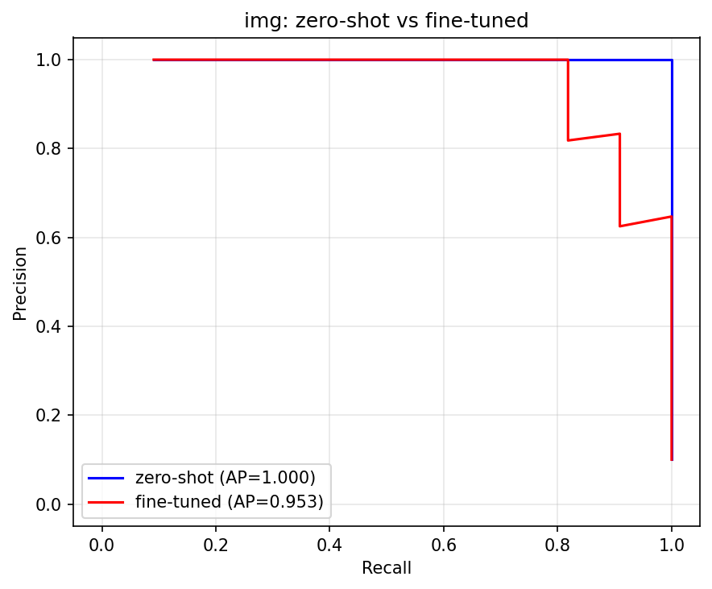
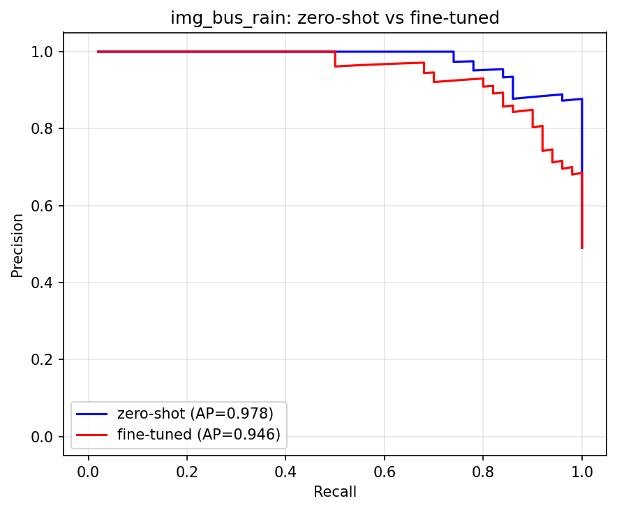

# 画像分類

reCAPTCHA の「お題に合う画像を選ぶ」課題を、画像分類で解く側のまとめ。
お題は今のところ bus だけに絞っている。

## やりたいこと

9枚の画像から「バスが写っているもの」を選ぶ。
位置(座標)は出さず、1枚ごとに「バスか、そうでないか」を判定するだけ。
マスの位置を出す物体検出は別の班がやっていて、こちらは触らない。

試した手は2つ。

- zero-shot は、ImageNet で学習済みの ResNet18 をそのまま使う。学習しない。(`classification.py`)
- fine-tuning(FT)は、その ResNet18 を bus と other の2クラスに微調整する。(`train_resnet.py`)

結論を先に書くと、bus については **zero-shot で十分**だった。FT はむしろ少し成績を落とした。理由は後述する。

## ディレクトリの中身

直下が現役のパイプライン。`未使用/` は役目を終えたファイルの置き場。

| ファイル | 役割 |
|---|---|
| `classification.py` | zero-shot ResNet。学習なしでバス確信度を出す |
| `data_augment.py` | 夜・雨の加工を作る共通部品。download系2本が読む |
| `download_train_bus.py` | COCO からバス画像を取得し、原本/夜/雨の3枚に加工して `dataset/train/bus/` へ |
| `download_train_other.py` | 同じ加工で「バス以外」を `dataset/train/other/` へ |
| `split_train_val.py` | `dataset/train` を train と val に分ける |
| `train_resnet.py` | FT 本体。`best_resnet18_bus.pth` を吐く |
| `ex_train_bus.py` | BDD100K から過酷な環境のバスを抜き出す(外部データが要る。今は未使用に近い) |
| `predict_recaptcha.py` | 学習済みモデルでマス画像を判定する |
| `plot.py` | 学習ログをグラフにする |
| `eval/` | 評価一式(後述) |

## データの作り方

学習データは COCO から自動で集める。最初の1回だけ注釈 zip(約240MB)を落とすので時間がかかる。

```
# リポジトリのルートで実行する(下のコマンドは全部そう)
python 画像分類/download_train_bus.py     # → dataset/train/bus/   に 300枚
python 画像分類/download_train_other.py   # → dataset/train/other/ に 300枚
python 画像分類/split_train_val.py        # → train 240/240, val 60/60 に分割
```

ここで一度ハマったので残しておく。

**偏りの修正。** 最初は bus が素の昼間画像100枚だけで、other だけに夜・雨の加工版があった。これだと「暗い画像 = バスじゃない」と覚えてしまい、雨のバスをほぼ全部取りこぼす。bus にも同じ夜・雨加工を入れて、両クラスとも 300枚(原本100/夜100/雨100)にそろえた。加工処理は `data_augment.py` に1つだけ置いて、bus と other が必ず同じ条件になるようにしてある。

**リークの修正。** 原本、夜、雨は同じ景色なので、ファイル単位でランダムに train/val を分けると、同じ景色が両方に入って val の点数が甘くなる。`split_train_val.py` は元画像のID単位でまとめて分けるので、3枚は必ず train か val のどちらか片方に入る。

> 根拠。枚数はフォルダを数えれば確認できる(`ls dataset/train/bus | wc -l` など)。300 は「ベース100枚 × (原本/夜/雨)の3」。240/60 は val を2割にした分割(100枚の元画像のうち20枚分=60ファイルを val へ)で、`split_train_val.py` の出力ログにも出る。

## 学習

```
python 画像分類/train_resnet.py
```

Mac の MPS で 10エポック、だいたい1分で終わる。出力はルートに2つ。

- `best_resnet18_bus.pth` … 重み
- `best_resnet18_bus_classes.json` … クラスの並び(`["bus", "other"]`)。推論側がどっちが bus か迷わないように一緒に保存している

ベストモデルは Accuracy ではなく bus の F1 で選ぶ。捕捉漏れと誤検出のバランスを見たいので。
今回のベストは epoch 5 で val F1 = 0.828。ただし epoch 3 あたりから train はほぼ満点なのに val の loss が上がっていく。元画像が200枚と少ないので過学習している。エポックを増やす意味は薄い。

> 根拠。これらは `train_resnet.py` の実行ログ。各エポックで Val の bus に対する TP/FP/FN と F1 を出していて、F1 が最大の epoch をベストとして `.pth` に保存する。0.828 はその epoch 5 の Val F1。

## 評価

`eval/` に2本ある。どちらも本物の評価画像を使う。

- `img/` … 晴れ(劣化なし)。正例11 / 負例99
- `img_bus_rain/` … 雨(劣化あり)。正例50 / 負例52

> 根拠。正例/負例の数は、ラベルCSV(`eval/labels/img_labels.csv` と `img_bus_rain_labels.csv`)の `has_bus` 列を数えたもの。True が正例、False が負例。

合成した夜・雨は学習にだけ使い、評価には混ぜない。自分でかけたフィルタで評価すると、フィルタを戻す力を測るだけになって、本物のキャプチャでの強さが分からなくなるため。

```
# zero-shot 単体の評価(PR曲線とレポートが出る)
python 画像分類/eval/evaluate.py --image-dir img --labels 画像分類/eval/labels/img_labels.csv
python 画像分類/eval/evaluate.py --image-dir img_bus_rain --labels 画像分類/eval/labels/img_bus_rain_labels.csv

# zero-shot vs FT の比較(本命)
python 画像分類/eval/compare_models.py
```

### 指標の意味(初学者向け)

モデルは画像ごとに「バスっぽさ」を 0〜1 のスコアで出す。ある値(閾値)以上のものを「選ぶ」。閾値を上げれば慎重に、下げれば大胆に選ぶことになる。

まず選んだ結果を4種類に分ける。

- TP … バスを正しく選んだ
- FP … バスじゃないのに選んだ(誤爆)
- FN … バスなのに選ばなかった(見逃し)
- TN … バスじゃないものを正しく見送った

この4つから2つの割合を作る。

- 適合率(precision) = TP / (TP + FP)。選んだ画像のうち、本当にバスだった割合。高いほど誤爆が少ない。
- 再現率(recall) = TP / (TP + FN)。本物のバス全部のうち、取りこぼさず選べた割合。高いほど見逃しが少ない。

この2つは綱引きの関係にある。慎重に選べば適合率は上がるが再現率は下がる。大胆に選べば逆になる。だから片方だけ見ても強さは分からない。そこで次の2つを使う。

- F1 … 適合率と再現率の調和平均。両方そこそこ高いと大きくなる。バランスの良い一点の強さ。
- PR-AUC(AP) … 閾値を端から端まで動かすと、適合率と再現率の関係が曲線になる(PR曲線)。その曲線の下の面積が AP。閾値をどこに決めるか選ばなくていいので、モデル全体の力を1つの数で表せる。1.0 が満点。

zero-shot と FT はスコアの作り方が違うが、どちらも 0〜1 のバスっぽさなので、同じ AP の軸で並べて比べられる。

### 結果(AP)

| 評価データ | 正例/負例 | zero-shot AP | fine-tuned AP | 差(FT−ZS) |
|---|---:|---:|---:|---:|
| 晴れ (img) | 11/99 | 1.000 | 0.953 | −0.047 |
| 雨 (img_bus_rain) | 50/52 | 0.978 | 0.930 | −0.049 |

> 根拠。AP の値は `uv run python 画像分類/eval/compare_models.py` の出力。同じ表が `eval/results/zeroshot_vs_ft_比較.md` にも保存される。計算は `compare_models.py` の `compute_average_precision` が、各画像のスコアを高い順に並べ、1枚ずつ選択を増やしながら 適合率 ×(再現率の増分) を足してPR曲線の面積を求めている。

読み方の例。晴れの zero-shot は AP=1.000、つまりスコアの高い順に並べると、上位にバスがきれいに固まっていて、どこで線を引いてもバスだけを選べる状態。満点。fine-tuned の 0.953 は、たまにバス以外が上位に混ざる。差の −0.047 は FT のほうが 0.047 ぶん悪い、という意味。

晴れも雨も zero-shot の勝ち。FT は両方で 0.05 ほど下がった。

### PR曲線

線が右上(面積が広い)ほど強い。青の zero-shot が、赤の fine-tuned を両方とも上に抜けている。

晴れ:



雨:



### AP以外の数字で見る

APは1つの要約値なので、運用に近い数字も出した。

| 評価データ | モデル | 最大F1(閾値) | 適合率1.0での再現率 | 再現率1.0での適合率 |
|---|---|---:|---:|---:|
| 晴れ | zero-shot | 1.000 (0.034) | 1.000 | 1.000 |
| 晴れ | fine-tuned | 0.900 (0.995) | 0.818 | 0.647 |
| 雨 | zero-shot | 0.935 (0.001) | 0.740 | 0.877 |
| 雨 | fine-tuned | 0.842 (0.554) | 0.560 | 0.556 |

> 根拠。同じ `compare_models.py` の出力(`key_metrics`)。最大F1=閾値を全部試してF1が一番高くなった点と、そのときの閾値。適合率1.0での再現率=誤爆をゼロに保てる範囲で拾えた最大の再現率。再現率1.0での適合率=バスを全部拾うと決めたときに、選択がどれだけ綺麗か。

表の2つの新しい列は、両端の極端な使い方を見るためのもの。

- 「適合率1.0での再現率」は、ハズレを1枚も選ばないと決めたとき、何割のバスを拾えるか。
- 「再現率1.0での適合率」は、バスを1枚も見逃さないと決めたとき、選んだ中のどれだけが本当にバスか。

晴れだと zero-shot は全部正解だった。バス11枚を取りこぼしも誤選択もなしで拾える(3つの列が全部1.000)。FT は同じ晴れでも、バスを全部拾おうとすると適合率が0.647まで落ちる。これは、11枚のバスを全部拾うのに17枚くらい選ぶ必要があり、そのうち6枚はバス以外、という意味(11 ÷ 0.647 ≒ 17、ハズレ約6枚で 6/17 ≒ 35%)。逆に誤選択をゼロに抑えると、今度は11枚中9枚しか拾えず2枚を見逃す(再現率0.818 = 9/11)。

雨はもっと差が開く。zero-shot はバス50枚を全部拾っても適合率0.877で、取り違えは数枚にとどまる。FT で同じことをすると適合率0.556まで落ちる。50枚を全部拾うのに90枚くらい選ぶことになり、うち40枚ほどがバス以外(50 ÷ 0.556 ≒ 90)。選んだものの半分近くがハズレで、9枚のキャプチャでこれなら使い物にならない。

### なぜ FT が負けたか

理由はたぶん3つ。事前学習済みの ResNet がもともとバスをほぼ完璧に見分けること。200枚での微調整が過学習したこと(学習ログでも train はすぐ満点になり val の loss が上がっていった)。そして、自作の夜・雨フィルタが `img_bus_rain` の本物の雨に効かなかったこと。

これは失敗ではなく結果として使える。bus のように ImageNet にあるお題は zero-shot で足りる。FT の効き目を見せたいなら、ImageNet に無い・弱いお題(消火栓、横断歩道、階段など)で測るべき、という話になる。

## ゼロから再現する

このリポジトリの中間ファイルが手元に無くても、同じ結果まで辿り着けるように書く。
学習データは外から取り直し、モデルは作り直す前提。

### 必要なもの

- macOS か Linux。Mac なら学習に MPS が使える。無ければ CPU でも動く(少し遅いだけ)。
- Python 3.12(`.python-version` で固定)。
- `uv`(パッケージ管理)。
- ネット接続。学習データを COCO から落とすので要る。
- 使うパッケージは torch、torchvision、numpy、matplotlib、pillow。版は `uv.lock` で固定済み。

### 環境を作る

```
uv sync          # uv.lock のとおりにパッケージを入れる
```

以降のコマンドは `uv run python ...` で動かす。必ずリポジトリのルートで実行する。スクリプトは `dataset/` などを相対パスで見ているので、`cd 画像分類` してからだと壊れる。

### データの出どころ

ここがゼロ再現の肝。2種類あって、片方は自動、片方は手作りの固定データ。

**学習データ(自動で作れる)。** `download_train_bus.py` と `download_train_other.py` が COCO 2017 の train 注釈 zip を落として、bus とそれ以外を選んで加工する。選び方も加工もシード42で固定なので、同じ COCO からなら毎回同じ300枚×2クラスができる。`dataset/` と注釈 zip は容量が大きいので git には上げていない。下のコマンドで作り直す。

**評価データ(スクリプトでは作れない)。** `img/`(晴れ)と `img_bus_rain/`(雨)、それと `eval/labels/` のラベルCSVは、人がバスの有無(`has_bus`)を付けた固定の資産。COCO 由来の画像だが、ラベルは手付けなので自動生成できない。リポジトリの外でゼロからやるなら、この画像群とラベルを持ってくるか、同等の評価セットを自分で用意してラベルを付け直す必要がある。ここだけは完全な自動再現にはならない。

### 全手順(クリーンな環境で)

```
# 1. 環境
uv sync

# 2. 学習データを COCO から作る(初回は注釈zip約240MBのDLで時間がかかる)
uv run python 画像分類/download_train_bus.py     # → dataset/train/bus/   300枚
uv run python 画像分類/download_train_other.py   # → dataset/train/other/ 300枚
uv run python 画像分類/split_train_val.py        # → train 240/240, val 60/60

# 3. 学習(best_resnet18_bus.pth と classes.json がルートに出る)
uv run python 画像分類/train_resnet.py

# 4. 評価(img/ img_bus_rain/ とラベルが必要)
uv run python 画像分類/eval/compare_models.py
```

### どこまで固定できているか

- シードは全部42(`data_augment.py`、`split_train_val.py`、`train_resnet.py`)。同じ手順なら同じ分割と同じ学習になる。
- パッケージの版は `uv.lock` で固定。
- 固定しきれない部分もある。COCO 側の画像URLが将来変われば取得物が変わる。評価セットは上に書いたとおり手作りで、スクリプトからは作れない。MPS と CPU で計算順が変わり、APの下のほうの桁が少しぶれることはある。
