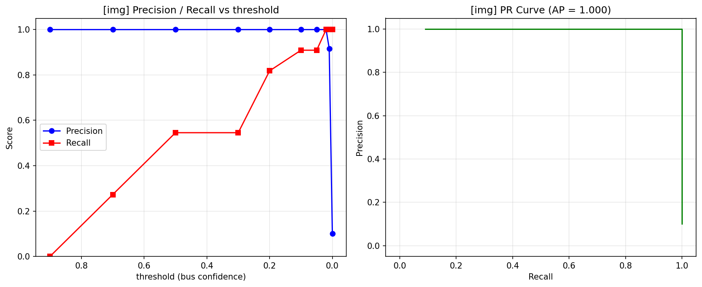

# 分類モデル評価結果 (閾値スイープ)

## 実験条件

- 画像ディレクトリ: `img`
- 正解ラベル: `eval/labels/img_labels.csv`
- お題: `bus`
- モデル: ResNet18 (ImageNet事前学習済み)
- 評価画像数: 110 枚（正例 11 枚 / 負例 99 枚）
- **PR-AUC (Average Precision): 1.000**

## 評価指標の定義

| 指標 | 定義 | 計算式 |
|---|---|---|
| TP (真陽性) | バスが写っている画像をモデルが正しく選択した枚数 | — |
| FP (偽陽性) | バスが写っていない画像をモデルが誤って選択した枚数 | — |
| FN (偽陰性) | バスが写っている画像をモデルが見逃した枚数 | — |
| TN (真陰性) | バスが写っていない画像をモデルが正しく除外した枚数 | — |
| 適合率 (Precision) | 選択した中に実際にバスが写っていた割合 | TP / (TP + FP) |
| 再現率 (Recall) | バス画像全体のうちモデルが漏らさず選択できた割合 | TP / (TP + FN) |
| PR-AUC (AP) | 閾値を動かして描いたPR曲線の下側の面積（閾値非依存の総合性能） | — |

## 評価方法

各画像について「バスである確信度スコア (0〜1)」を計算し、
スコアが閾値以上の画像を選択とみなして適合率・再現率を求めた。
閾値を動かして描いたPR曲線の下側の面積が PR-AUC (AP) であり、
閾値に依存しない総合性能としてモデル同士の比較に使える。
この評価軸はファインチューニング後のモデルでも同じく使えるため、
生ResNetとFT後を同じPR曲線・同じAPで比較できる。

## 閾値別の評価結果

| 閾値 | TP | FP | FN | TN | 選択数 | 適合率 | 再現率 | F1 |
|---:|---:|---:|---:|---:|---:|---:|---:|---:|
| 0.90 | 0 | 0 | 11 | 99 | 0 | 1.000 | 0.000 | 0.000 |
| 0.70 | 3 | 0 | 8 | 99 | 3 | 1.000 | 0.273 | 0.429 |
| 0.50 | 6 | 0 | 5 | 99 | 6 | 1.000 | 0.545 | 0.706 |
| 0.30 | 6 | 0 | 5 | 99 | 6 | 1.000 | 0.545 | 0.706 |
| 0.20 | 9 | 0 | 2 | 99 | 9 | 1.000 | 0.818 | 0.900 |
| 0.10 | 10 | 0 | 1 | 99 | 10 | 1.000 | 0.909 | 0.952 |
| 0.05 | 10 | 0 | 1 | 99 | 10 | 1.000 | 0.909 | 0.952 |
| 0.02 | 11 | 0 | 0 | 99 | 11 | 1.000 | 1.000 | 1.000 |
| 0.01 | 11 | 1 | 0 | 98 | 12 | 0.917 | 1.000 | 0.957 |
| 0.00 | 11 | 99 | 0 | 0 | 110 | 0.100 | 1.000 | 0.182 |

## グラフ

左: 閾値を変えたときの適合率・再現率の推移。  
右: 適合率-再現率曲線（左上に近いほど高性能、面積=AP）。

## 考察

- PR-AUC (AP) = **1.000**（閾値に依存しないモデル全体の性能）。
- F1スコアが最大になる閾値: **0.02** (F1 = 1.000)。
- 閾値を下げると再現率は上がるが適合率は下がる（精度とカバレッジのトレードオフ）。
- FT後のモデルも同じ閾値スイープで評価すれば、APの大小で改善幅を比較できる。
