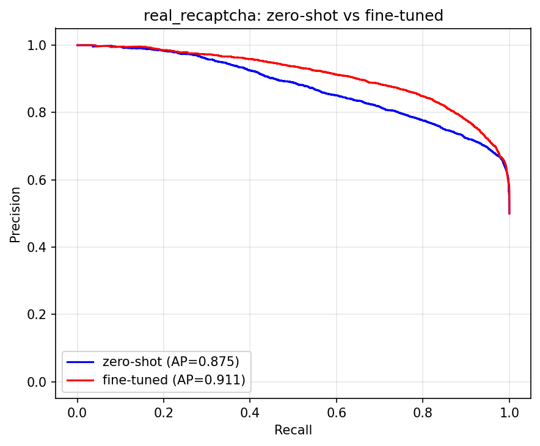

# zero-shot ResNet vs ファインチューニング後 比較

本物の評価データ（晴れ=img / 雨=img_bus_rain）に対して、
ImageNet事前学習のままのResNet（zero-shot）と、
bus/other 2クラスに微調整したResNet（fine-tuned）を、
**同じ PR-AUC (Average Precision) 軸**で比較した結果。

| データセット | 正例/負例 | zero-shot AP | fine-tuned AP | 差分(FT−ZS) |
|---|---:|---:|---:|---:|
| 晴れ (img) | 11/99 | 1.000 | 0.984 | -0.016 |
| 雨 (img_bus_rain) | 50/52 | 0.978 | 0.946 | -0.032 |
| 本物 (real_recaptcha) | 6693/6693 | 0.875 | 0.911 | +0.036 |

## 詳しい指標

AP だけでは見えない実用面の数値も並べる。
「適合率1.0での再現率」は、誤検出ゼロのまま何割のバスを拾えるか。
「再現率1.0での適合率」は、バスを全部拾おうとしたとき選択がどれだけ綺麗か。

| データセット | モデル | AP | 最大F1 (閾値) | 適合率1.0での再現率 | 再現率1.0での適合率 |
|---|---|---:|---:|---:|---:|
| 晴れ (img) | zero-shot | 1.000 | 1.000 (0.034) | 1.000 | 1.000 |
| 晴れ (img) | fine-tuned | 0.984 | 0.957 (0.906) | 0.818 | 0.917 |
| 雨 (img_bus_rain) | zero-shot | 0.978 | 0.935 (0.001) | 0.740 | 0.877 |
| 雨 (img_bus_rain) | fine-tuned | 0.946 | 0.874 (0.249) | 0.500 | 0.685 |
| 本物 (real_recaptcha) | zero-shot | 0.875 | 0.806 (0.003) | 0.036 | 0.561 |
| 本物 (real_recaptcha) | fine-tuned | 0.911 | 0.836 (0.309) | 0.043 | 0.586 |

## PR曲線

### 晴れ (img)

### 雨 (img_bus_rain)

### 本物 (real_recaptcha)

## 読み方

- AP（PR-AUCの値）が大きいほど高性能。1.0が理想。
- 差分が正なら fine-tuning で改善、負なら zero-shot の方が強い。
- 晴れと雨で差を比べると、劣化画像に対する強さの違いが分かる。
- zero-shot と fine-tuned は前処理が異なる（zero-shot=パディング / FT=Resize）。
  各モデルを学習時と同じ前処理で測ることで、公平な比較にしている。
